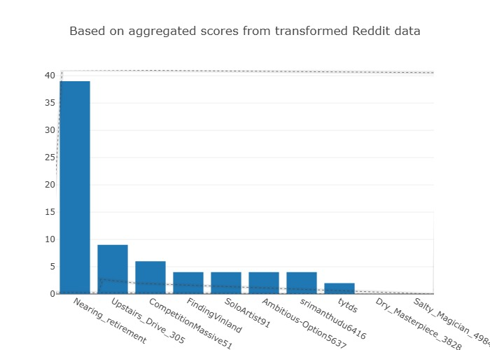

# 🚀 Real-Time Reddit Big Data ETL Pipeline on AWS (Glue + Redshift)

A fully automated **real-time Reddit data engineering pipeline** designed to extract, transform, and analyze live Reddit posts using a modern AWS cloud-native architecture.

The project uses:

* **Apache Airflow** for orchestration
* **AWS Glue** for transformation
* **Amazon S3** for storage
* **Amazon Redshift** and **Amazon Athena** for querying
* **Power BI**, **Amazon QuickSight**, and **Tableau** for visualization.

---

## 🏗️ 1. System Architecture

docs/screenshots/System_Architecutre-1.png

**Key Components:**

* **Reddit API**: Live data source.
* **Airflow DAG**: Automates data ingestion.
* **PostgreSQL & Docker**: Local storage during ingestion.
* **Amazon S3 (Raw & Transformed)**: Centralized cloud storage.
* **AWS Glue & Crawler**: Metadata creation and ETL.
* **Athena + Redshift**: Query and analytics.
* **Visualization**: Dashboards with BI tools.
* **IAM**: Secure access and role management.

---

## 🧭 2. Pipeline Implementation & Workflow

### 🪄 Step 1 — Data Orchestration using Airflow


* A DAG named `etl_reddit_pipeline` triggers scheduled runs.
* `PythonOperator` extracts Reddit posts through API.


* Logs confirm successful execution of extraction and staging.

---

### 🧾 Step 2 — Raw Data Extraction to CSV


* Data extracted is first processed into **structured CSV format**.
* Each record includes fields like `id`, `title`, `selftext`, `score`, `num_comments`, `created_utc`, etc.

---

### 🪣 Step 3 — Upload to Amazon S3 (Raw Zone)


* Files are stored in the **Raw Layer** inside S3.
* Separate buckets/folders are maintained for:

  * `raw` — raw ingested CSVs
  * `transformed` — cleaned & structured Parquet files
  * `athena_output` — query results

---

## 🧼 3. ETL with AWS Glue

### ⚙️ Step 4 — Data Transformation


* An AWS Glue job converts CSV to Parquet with Snappy compression.


* The output is stored in the **transformed layer** on S3.
* This improves **storage efficiency** and **query performance**.

---

### 🕸️ Step 5 — Metadata Management with Glue Crawler


* Glue Crawler scans transformed S3 data.
* Automatically creates a **schema** and registers it in **AWS Glue Data Catalog** under `reddit_db`.
* Enables seamless querying via Athena and Redshift Spectrum.

---

## 🧪 4. Querying Layer

### 🔍 Step 6 — Amazon Athena Query


* Athena reads data directly from S3 using the Glue Data Catalog.
* Example query:

  ```sql
  SELECT * 
  FROM "AwsDataCatalog"."reddit_db"."transformed_data"
  LIMIT 10;
````

* Validates the data pipeline output.

---

### 🏢 Step 7 — Amazon Redshift Integration


* **Amazon Redshift Serverless** is configured.
* External tables are mapped to S3 through the Glue Data Catalog.
* Ideal for large-scale analytics and BI integration.

---

### 📊 Step 8 — Query & Visualization in Redshift


* Query to analyze total scores per author:

  ```sql
  SELECT author, SUM(score) AS total_score
  FROM "awsdatacatalog"."reddit_db"."transformed_data"
  GROUP BY author
  ORDER BY total_score DESC
  LIMIT 10;
  ```

.jpeg>)



* The result is visualized as **bar charts**, enabling quick insights.

---

## 🧰 5. Tech Stack

| Layer                     | Tools / Services                     |
| ------------------------- | ------------------------------------ |
| Ingestion & Orchestration | Apache Airflow, PostgreSQL, Docker   |
| Storage                   | Amazon S3                            |
| Transformation            | AWS Glue                             |
| Metadata Catalog          | AWS Glue Data Catalog, AWS Crawler   |
| Query Layer               | Amazon Athena, Amazon Redshift       |
| Visualization             | Power BI, Amazon QuickSight, Tableau |
| Security                  | AWS Identity and Access Management   |

---

## 🧭 6. Project Folder Structure

```
📦 RealTime-Reddit-BigData-ETL-Pipeline-on-AWS-Glue-Redshift
│
├── 📁 dags/
│   ├── etl_reddit_pipeline.py          # Airflow DAG definition
│   ├── operators/                      # (optional) custom operators if any
│   └── utils/                          # helper scripts (e.g., logging, retries)
│
├── 📁 config/
│   ├── credentials_template.json       # (sample structure without secrets)
│   ├── airflow_variables.json          # for airflow variables if needed
│   └── config.yaml                     # global configs (API endpoints, S3 paths)
│
├── 📁 data/
│   ├── raw/                            # local copy of raw Reddit data
│   └── processed/                      # local copy of processed files
│
├── 📁 etls/
│   ├── reddit_extraction.py            # script to extract Reddit posts
│   ├── transformation.py               # cleaning / structuring data
│   └── s3_upload.py                    # handles uploading data to S3
│
├── 📁 pipelines/
│   └── reddit_pipeline_runner.py       # main orchestrator (optional, CLI run)
│
├── 📁 plugins/
│   └── __init__.py                     # for custom Airflow plugins if required
│
├── 📁 utils/
│   ├── helpers.py                      # reusable helper functions
│   ├── logger.py                       # structured logging
│   └── constants.py                    # constant variables
│
├── 📁 images/
│   ├── System_Architecutre.png
├── 📄 requirements.txt                 # Python dependencies (Airflow, boto3, etc.)
├── 📄 docker-compose.yaml              # Airflow local environment setup
├── 📄 Dockerfile                       # containerization (optional)
├── 📄 README.md                        # full project documentation
├── 📄 .env.example                     # sample environment variables (no secrets)
├── 📄 .gitignore                       # to exclude sensitive/local files
└── 📄 LICENSE                          # optional, for open-source repo
```

---

## ⚙️ 7. How to Run Locally

1. **Start Airflow**

   ```bash
   docker-compose up -d
   ```
2. **Trigger the DAG** from Airflow UI.
3. **View output** in S3, Athena, and Redshift.

---

## 🚀 8. Key Features

* ✅ Real-time Reddit data ingestion
* 🧼 Automated ETL pipeline using Airflow & Glue
* 🪣 S3 Medallion Architecture (Raw → Transformed)
* 🧭 Glue Crawler for schema inference
* 📊 Athena & Redshift for analytics
* 🔐 Secure IAM roles and policies
* 📈 BI-ready dashboards

---

## 🌱 9. Future Enhancements

* ⏩ Implement streaming ingestion with Apache Kafka or Kinesis
* 🧮 Integrate machine learning models on transformed data
* ☁️ Add CI/CD pipeline for infra deployment using Terraform
* 📊 Real-time dashboards with Power BI / QuickSight

---

## 👨‍💻 10. Author

**Raghav**
📍 Data Engineer | Cloud & Big Data Enthusiast
🔗 [GitHub Repository](https://github.com/ragztigadi/RealTime-Reddit-BigData-ETL-Pipeline-on-AWS-Glue-Redshift)

```